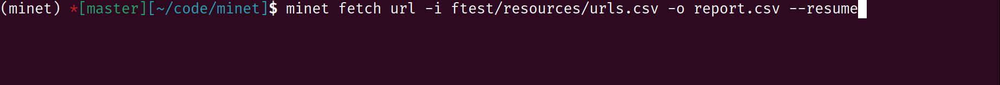

[](https://github.com/medialab/minet/actions) [](https://zenodo.org/badge/latestdoi/169059797) [](https://pepy.tech/project/minet)


**minet** is a webmining command line tool & library for python (>= 3.7) that can be used to collect and extract data from a large variety of web sources such as raw webpages, Facebook, CrowdTangle, YouTube, Twitter, Media Cloud etc.

It adopts a very simple approach to various webmining problems by letting you perform a wide array of tasks from the comfort of the command line. No database needed: raw CSV files should be sufficient to do most of the work.

In addition, **minet** also exposes its high-level programmatic interface as a python library so you remain free to use its utilities to suit your use-cases better.

**minet** is developed by [médialab SciencesPo](https://github.com/medialab/) research engineers and is the consolidation of more than a decade of webmining practices targeted at social sciences.

As such, it has been designed to be:

1. **low-tech**, as it requires minimal resources such as memory, CPUs or hard drive space and should be able to work on any low-cost PC.
2. **fault-tolerant**, as it is able to recover when network is bad and retry HTTP calls when suitable. What's more, most of minet commands can be resumed if aborted and are designed to run for a long time (think days or months) without leaking memory.
3. **unix-compliant**, as it can be piped easily and know how to work with the usual streams.

**Shortcuts**: [Command line documentation](./docs/cli.md), [Python library documentation](./docs/lib.md).



_How to cite?_

**minet** is published on [Zenodo](https://zenodo.org/) as [10.5281/zenodo.4564399](http://doi.org/10.5281/zenodo.4564399).

You can cite it thusly:

> Guillaume Plique, Pauline Breteau, Jules Farjas, Héloïse Théro, Jean Descamps, Amélie Pellé, Laura Miguel, & César Pichon. (2019, October 14). Minet, a webmining CLI tool & library for python. Zenodo. http://doi.org/10.5281/zenodo.4564399

## Whirlwind tour

```bash
# Downloading large amount of urls as fast as possible
minet fetch url -i urls.csv > report.csv

# Extracting raw text from the downloaded HTML files
minet extract -i report.csv -I downloaded > extracted.csv

# Scraping the urls found in the downloaded HTML files
minet scrape urls -i report.csv -I downloaded > scraped_urls.csv

# Parsing & normalizing the scraped urls
minet url-parse scraped_url -i scraped_urls.csv > parsed_urls.csv

# Scraping data from Twitter
minet twitter scrape tweets "from:medialab_ScPo" > tweets.csv

# Printing a command's help
minet twitter scrape -h

# Searching videos on YouTube
minet youtube search -k "MY-YT-API-KEY" "médialab" > videos.csv
```

## Summary

- [What it does](#what-it-does)
- [Documented use cases](#documented-use-cases)
- [Features (from a technical standpoint)](#features-from-a-technical-standpoint)
- [Installation](#installation)
- [Upgrading](#upgrading)
- [Uninstallation](#uninstallation)
- [Documentation](#documentation)
- [Contributing](#contributing)

## What it does

Minet can single-handedly:

- Extract URLs from a text file (or a table)
- Parse URLs (get useful information, with Facebook- and Youtube-specific stuff)
- Join two CSV files by matching the columns containing URLs
- From a list of URLs, resolve their redirections
  - ...and check their HTTP status
  - ...and download the HTML
  - ...and extract hyperlinks
  - ...and extract the text content and other metadata (title...)
  - ...and scrape structured data (using a declarative language to define your heuristics)
- Crawl (using a declarative language to define a browsing behavior, and what to harvest)
- Mine or search:
  - _[Buzzsumo](https://buzzsumo.com/)_ (requires API access)
  - _[Crowdtangle](https://www.crowdtangle.com/)_ (requires API access)
  - _[Mediacloud](https://mediacloud.org/)_ (requires free API access)
  - _[Twitter](https://twitter.com)_ (requires free API access)
  - _[Wikipedia](https://ww.wikipedia.org)_
  - _[Youtube](https://www.youtube.com/)_ (requires free API access)
- Scrape (without requiring special access, often just a user account):
  - _[Facebook](https://www.facebook.com/)_
  - _[Instagram](https://www.instagram.com/)_
  - _[Telegram](https://telegram.org/)_
  - _[TikTok](https://www.tiktok.com)_
  - _[Twitter](https://twitter.com)_
  - _[Google Drive](https://drive.google.com)_ (spreadsheets etc.)
- Grab & dump cookies from your browser
- Dump _[Hyphe](https://hyphe.medialab.sciences-po.fr/)_ data

## Documented use cases

- [Fetching a large amount of urls](./docs/cookbook/fetch.md)
- [Joining 2 CSV files by urls](./docs/cookbook/url_join.md)
- [Using minet from a Jupyter notebook](./docs/cookbook/notebooks/Minet%20in%20a%20Jupyter%20notebook.ipynb) (_very useful to experiment with the tool or teach students_)
- [Downloading images associated with a given hashtag on Twitter](./docs/cookbook/twitter_images.md)
- [Scraping DSL Tutorial](./docs/cookbook/scraping_dsl.md)

## Features (from a technical standpoint)

- Multithreaded, memory-efficient fetching from the web.
- Multithreaded, scalable crawling using a comfy DSL.
- Multiprocessed raw text content extraction from HTML pages.
- Multiprocessed scraping from HTML pages using a comfy DSL.
- URL-related heuristics utilities such as extraction, normalization and matching.
- Data collection from various APIs such as [CrowdTangle](https://www.crowdtangle.com/).

## Installation

**minet** can be installed as a standalone CLI tool (currently only on mac >= 10.14, ubuntu & similar) by running the following command in your terminal:

```shell
curl -sSL https://raw.githubusercontent.com/medialab/minet/master/scripts/install.sh | bash
```

Don't trust us enough to pipe the result of a HTTP request into `bash`? We wouldn't either, so feel free to read the installation script [here](./scripts/install.sh) and run it on your end if you prefer.

On ubuntu & similar you might need to install `curl` and `unzip` before running the installation script if you don't already have it:

```shell
sudo apt-get install curl unzip
```

Else, **minet** can be installed directly as a python CLI tool and library using pip:

```shell
pip install minet
```

Finally if you want to install the standalone binaries by yourself (even for windows) you can find them in each release [here](https://github.com/medialab/minet/releases).

## Upgrading

To upgrade the standalone version, simply run the install script once again:

```shell
curl -sSL https://raw.githubusercontent.com/medialab/minet/master/scripts/install.sh | bash
```

To upgrade the python version you can use pip thusly:

```shell
pip install -U minet
```

## Uninstallation

To uninstall the standalone version:

```shell
curl -sSL https://raw.githubusercontent.com/medialab/minet/master/scripts/uninstall.sh | bash
```

To uninstall the python version:

```shell
pip uninstall minet
```

## Documentation

- [minet as a command line tool](./docs/cli.md)
- [minet as a python library](./docs/lib.md)

## Contributing

To contribute to **minet** you can check out [this](./CONTRIBUTING.md) documentation.
