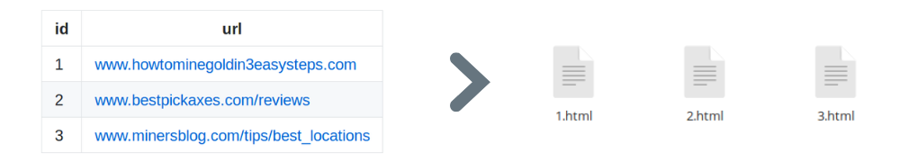
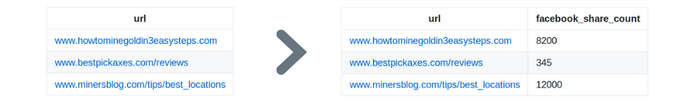

A webmining CLI tool & library for python.

*Minet* features:
- Multithreaded HTML fetching
- Multiprocessing text content extraction
- Facebook's share count fetching
- Custom scraping script?

## Installation

`minet` can be installed using pip:
```shell
pip install minet
```

## Commands

### fetch

Handy command to fetch the HTML content of every url provided in a *potentially huge* given csv.
Works in a multithreaded & lazy way (the csv is not loaded into memory), and starts where it stopped at last execution.

```shell
minet fetch COLUMN FILE
```
Additional options:
- **`-s STORAGE_LOCATION`** specifies the location where the (temporary) HTML files are stored.
  Is *./data* by default.
- **`-id COLUMN_NAME`** : name of the url ID column, if present in the csv `FILE`. Used for the name of the HTML files. 
    If not specified, UUIDs are generated. 
- **`--monitoring_file FILE_NAME`** : location of the monitoring file used to save progress.
    Is *./data/monitoring.csv* by default.



##### Example

Imagine you have a `urls.csv` file containing urls - in a column called `'urls'` - you want to extract data from. Just use this command:

```shell
minet fetch url urls.csv
```

That's it, your HTML files are stored in *./data/htmlfiles*, ready for text content extraction for instance.

---

### facebook

Quickly fetches the (*rounded**) Facebook share count of each url in a given csv, without the need of an API nor access token (and thus no rate limitation).
Works in a multithreaded & lazy way (the csv is not loaded into memory).

*The share count of a url is the sum of :*
- *the number of likes of the url*
- *the number of shares of the url*
- *the number of likes & comments on stories about this url*


```shell
minet facebook COLUMN FILE
```
Additional options:
- **`-o OUTPUT`** specifies the location of the output csv (being the source csv `FILE` with an additional *facebook_share_count* column).
    Is `stdout` by default.



##### Example

Let's say you have a `urls.csv` file with - in a `'url'` column - the urls you want the share count of.

Just use this command:

```shell
minet facebook url urls.csv -o urls_with_fb_data.csv
```

As a result, you get a `urls_with_fb_data.csv` file with a *facebook_share_count* column.
