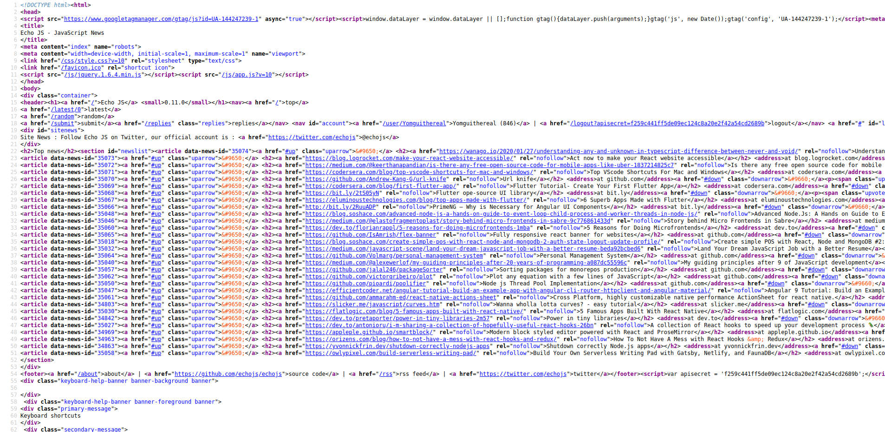
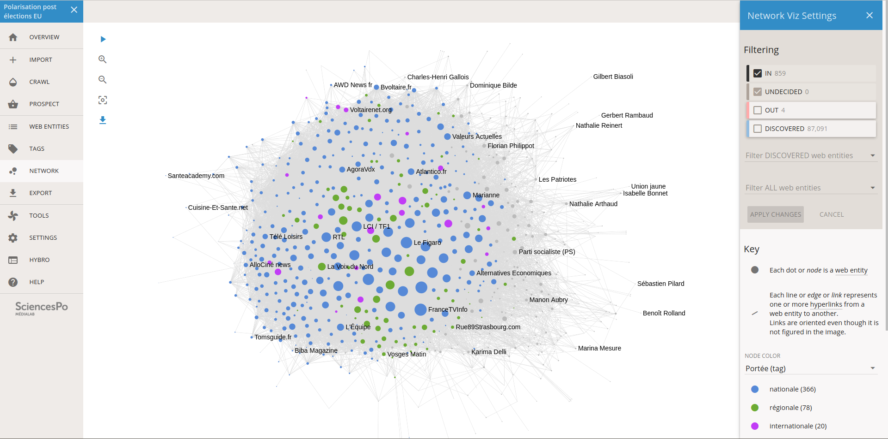
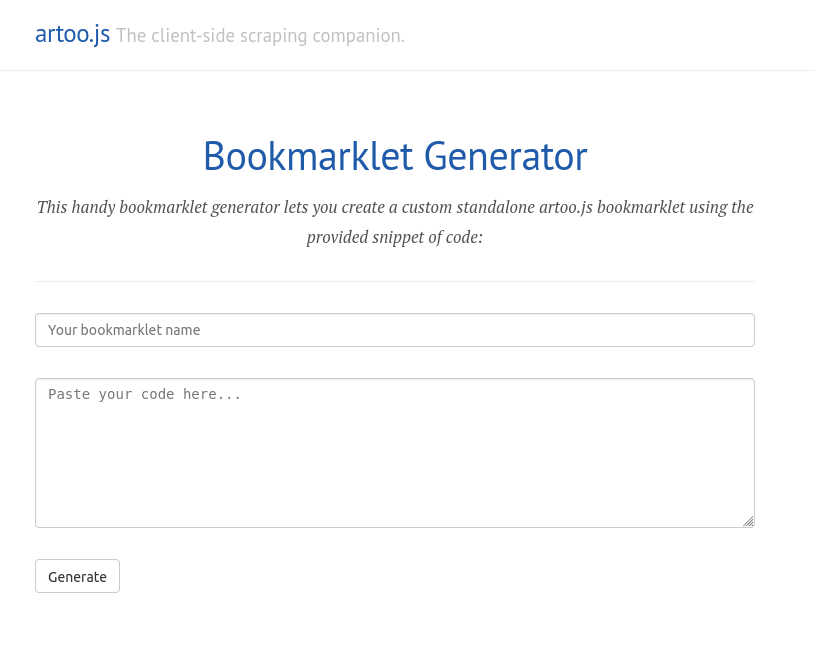
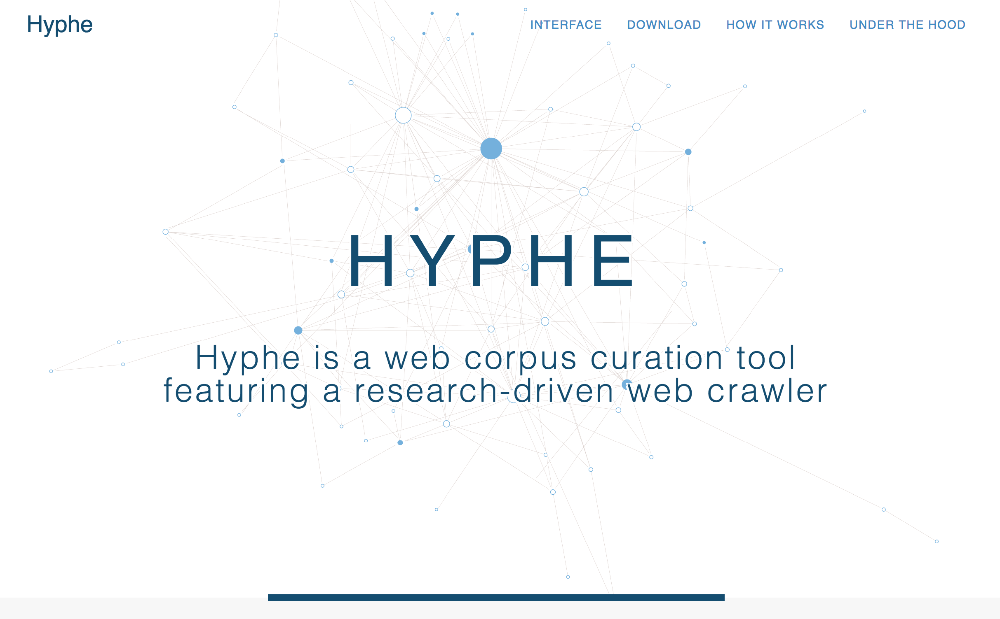
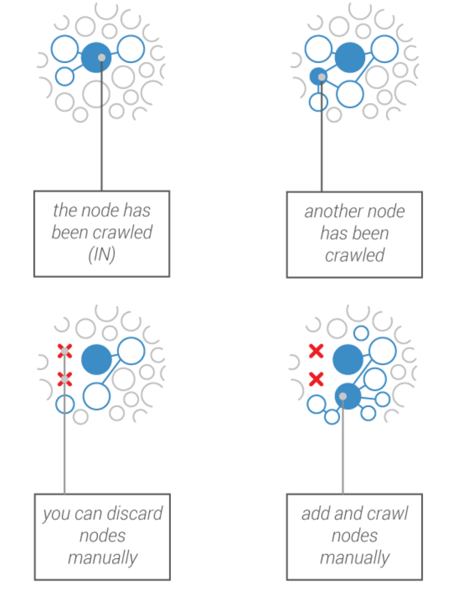

<style>
  h1, h2, h3 {
    background-color: #1f5baa;
    padding: 25px;
    color: white;
    text-align: center;
  }

  p {
    text-align: center;
  }

  h3 {
    padding: 15px;
  }

  a {
    color: #1f5baa;
  }

  ol {
    list-style-type: decimal-leading-zero;
    padding-left: 4em;
  }

  code {
    color: #CC3300;
  }

  code span {
    color: black;
  }

  code .hljs-keyword {
    color: #006699;
  }

  code .hljs-string {
    color: #CC3300;
  }
</style>

<style scoped>
  p {
    margin-bottom: 0;
  }

  p > em {
    font-size: 20px;
  }
</style>


# Empowering social scientists with web mining tools

*FOSDEM 2020*

*Open Research Tools and Technologies Devroom*

*Guillaume Plique, SciencesPo médialab*

---

# Why and how to enable researchers to perform complex web mining tasks?

---

<style scoped>
  img:first-child {
    margin-top: 30px;
  }
</style>

## Guillaume Plique, a.k.a. Yomguithereal


---

# What is web mining?

---

# Scraping


---



---

# Crawling



---

# Collecting data from APIs


---

# But why is this useful to [social] sciences?

---

## Bad take

1. Every social sciences data collection is biaised (i.e. observer's paradox)
2. People express themselves without being asked to, on the Internet
3. What's more they are not being observed (lol, I know...)
4. Web mining is therefore a superior source of data for social sciences!

---

## Good take

1. Internet data comes with its own biases that you should be aware of
2. Apply `media studies` and `STS` without moderation
3. Still is another data source. This cannot be shunned!

<!-- Note: Google Trends example -->

---

## Web mining is hard

You need to know The Web™:

`DNS` `HTTP` `HTML` `CSS` `JS` `DOM` `AJAX` `SSR` `CSR` `XPATH` ...

---

## How do you teach researchers web technologies

1. The same as anyone else really ([CSS as sushi plates anyone?](https://flukeout.github.io/))
2. What most consider as an easy layer of technologies really ISN'T
3. We really are standing on the shoulders of giants

---

## Teaching researchers how to scrape

1. Fighting the platforms and their APIs
2. Legal issues in some countries
3. Sometimes forbidden to teach it (~lock picking)
4. Publication wiggles (the monkey army)

---

## A point against the Jupyterization of researchers

1. Some researchers don't have the **time** nor the **will** to learn how to do advanced computer stuff.
2. This should be **OK**!

---

## Web mining is H.A.R.D.

It really is a craftsmanship.

---

## Internet is a dirty, dirty place

Browsers truly are heuristical wonders!

---

## Multithreading, parallelization, throttling etc.

Once we cut access to Google to our whole university!

---

## Complex spidering, scalability, storage, indexing, recombobulation, steam engines, fancy boats, unionization, agility, upper management, Peters syndrom, eXtreme programming

*Most of it is irrelevant and made up but you get the point...*

---

<style scoped>
  strong {
    text-decoration: underline;
  }
</style>

## How do we empower researchers then?

By **designing** tools suited to their research questions

---

# SciencesPo's médialab

1. Social Science Researchers
2. Designers
3. Engineers

---

## A brief history of the lab's webmining tools

1. [artoo.js](https://medialab.github.io/artoo/)
2. [minet](https://github.com/medialab/minet)
3. [Hyphe](https://hyphe.medialab.sciences-po.fr/)
4. ([Gazouilloire](https://github.com/medialab/gazouilloire))

---

## Parasitizing web browsers instead of emulating them!


[Demo Time!](https://www.echojs.com/)

<!-- Note: anecdote about the Selenium researchers -->

---

## Leveraging bookmarklets to empower researchers



<!-- Note: used for several hit jobs -->

---

<style scoped>
  p {
    margin-bottom: 0;
  }

  p > em {
    font-size: 20px;
  }
</style>

## But can we scale up?


*Not-contractual logo*

---

## The Unix philosophy

```
xsv search -s url urls.csv | minet fetch url -d html > result.txt
```

---

## The low-fi approach


<!-- Note: used for polarisation -->

---

## Relocalizing data collection

1. Sometimes you don't need a server
2. We are rarely doing BigData™
3. Let's put the researcher at the center so they can control their data

---

### A programmatic API

Jupyter's back y'all!

```python
from minet import multithreaded_fetch

for result in multithreaded_fetch(urls_iterator):
  print(result.status)
```

---

## Trade-off between scalability & usability

What about a GUI for minet?

We need to be able to **design** user paths.

---

## The next frontier: Crawling the Web

---



---

## A dedicated interface


---

## Serving a robust methodology



---

## Thank you for listening!

Pull requests welcome :)

<!--

* Gazouilloire

ToDo:

* Scraping and API "abusing" against platforms' hegemony
* we need to teach people how to scrape: legal issues in some countries => wiggling when publishing (the monkey army)

-->
